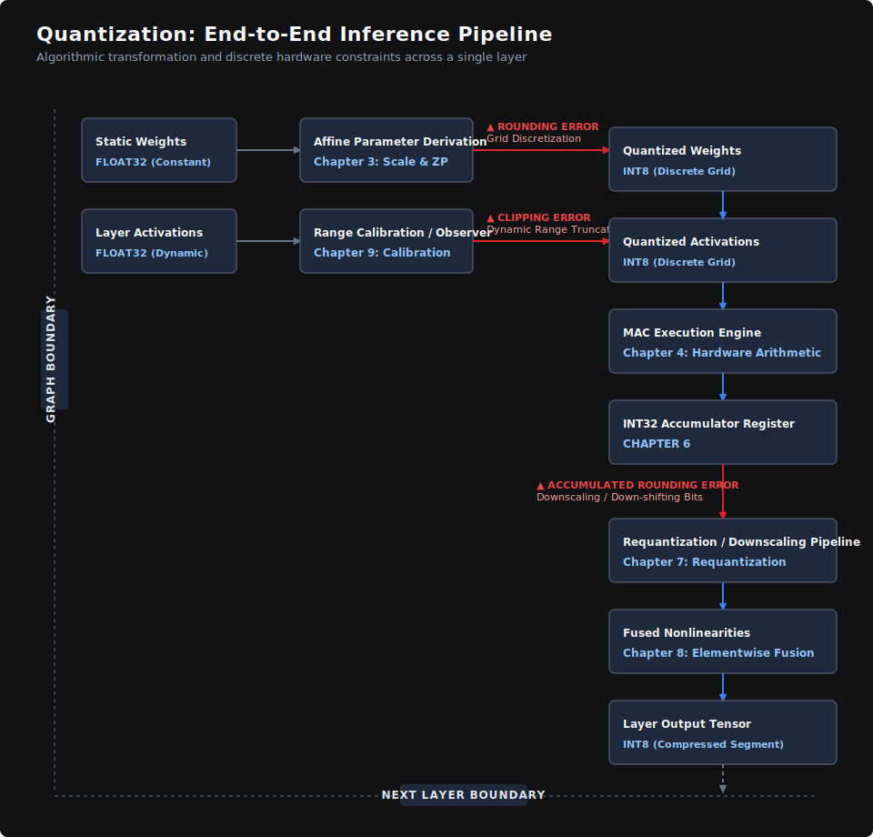

# Chapter 1: Why Quantization Exists

Models are often too large to fit in available GPU memory.
Latency is dominated by moving weights from memory, not by math.
In long-context generation, KV-cache memory keeps growing with token count.
Quantization is the practical trade: accept some accuracy loss to cut memory and speed up inference.
Concrete anchor: a 7B model is about 28GB in FP32 and about 7GB in INT8.
This chapter explains only why that trade is unavoidable in deployment.

## What Quantization Is

In this chapter, we focus on quantizing model parameters for inference economics.

Quantization is the process of mapping continuous floating-point values to a finite, discrete set of integer values using a mathematically derived scale factor.
(Scale is the fixed multiplier that maps integers back to real values.)
This hardware-focused optimization enables deep learning models to execute significantly faster and operate within tighter resource constraints when deployed on physical hardware layers.

During standard model training and development, networks operate in the high-precision environment of 32-bit floating-point precision (\\(\text{Float32}\\)), which provides a massive resolution of over four billion representable levels. While this near-infinite resolution is structurally necessary to capture the microscopic numerical gradients required during backpropagation, it forces a massive memory and computational burden during model deployment.

Quantization strips away this excessive resolution by replacing dense 32-bit values with coarser 8-bit (\\(\text{INT8}\\)) or 4-bit (\\(\text{INT4}\\)) representations. This transition collapses the available representational levels from billions down to just 256 or 16 points. Compressing the numerical space dramatically shrinks the model's physical memory footprint and accelerates arithmetic execution by routing operations through specialized low-precision datapaths on the chip. 

However, this compression permanently discards information, introducing a measurable loss in structural fidelity. The ultimate objective of this book is to analyze that loss at a systems level—identifying exactly where precision degrades, tracking how error propagates through silicon layers, and establishing engineering frameworks to preserve a model's functional intelligence under these tight hardware constraints.

---

## The Bottleneck Is Not Compute

A modern hardware accelerator or graphics processor can execute trillions of arithmetic operations per second. This capacity is tracked as peak compute throughput and measured in \\(\text{TFLOP/s}\\) (tera-floating-point operations per second, representing \\(10^{12}\\) operations per second). Because the raw multiplication throughput of modern silicon architecture is extraordinarily high, multiplication capacity is rarely the limiting factor during deep learning inference. 

The primary operational bottleneck stems from the physical challenge of moving data from off-chip memory to the compute units fast enough to keep the execution pipelines fully saturated. When an execution unit spends the majority of its clock cycles idling while waiting for parameter data to arrive across a bus, the workload is classified as *memory-bandwidth-bound*. Conversely, when data arrives quickly enough to keep the arithmetic units operating at peak capacity without interruption, the workload becomes *compute-bound*. For production language models—especially during real-time generation at low batch sizes—inference execution is heavily dominated by memory traffic rather than raw mathematical computation.

The math behind a 7-billion-parameter model stored in unquantized \\(\text{Float32}\\) precision highlights this constraint. This single model requires 28 gigabytes (GB) of physical memory storage. During deployment, the network operates in a weight-streaming regime, meaning every single one of those 7 billion parameters must be fetched from off-chip memory chips and loaded into the processor core during every single forward generation token step. 

If the underlying hardware features a maximum memory bandwidth of 900 GB/s, the time required simply to transfer the full model footprint across the physical bus evaluates as:

To see exactly where latency comes from, we quantify it:

\\[\text{Transfer Time} = \frac{28\text{ GB}}{900\text{ GB/s}} \approx 0.0311\text{ seconds}\\]

This raw data transit takes roughly 31 milliseconds before a single matrix multiplication can even be computed. Because the actual arithmetic computation takes only a tiny fraction of that time once the data arrives on-chip, the operational inference speed is dictated entirely by the bandwidth speed of the data bus.

Quantizing those same 7 billion parameters down to \\(\text{INT8}\\) reduces the model's storage footprint to 7 GB. Because each weight now occupies exactly 1 byte of memory instead of 4, the same physical memory bus can deliver four times as many parameters per second. The updated data transit time drops in direct proportion:

\\[\text{Transfer Time} = \frac{7\text{ GB}}{900\text{ GB/s}} \approx 0.0078\text{ seconds}\\]

This drop to roughly 7.8 milliseconds provides a clean \\(4\times\\) performance dividend driven entirely by reducing memory bandwidth pressure. Moving further down to an \\(\text{INT4}\\) representation cuts the parameter footprint to approximately 3.5 GB and drops the data transfer time to roughly 3.9 milliseconds. While specialized low-precision hardware accelerators offer massive arithmetic speedups, the primary performance breakthrough for large-scale production architectures stems almost entirely from this reduction in memory bus saturation.

---

## Energy Scales with Data Movement

Arithmetic operations themselves are remarkably inexpensive in terms of energy consumption. On a modern 7nm-class process node, a single 8-bit integer multiplication consumes roughly 0.2 picojoules (\\(\text{pJ}\\)) of energy, whereas a standard 32-bit floating-point multiplication costs approximately 3.7 pJ. While this represents an \\(18\times\\) energy disparity per arithmetic operation across the same silicon logic gates, neither figure represents the dominant operational cost of running a production model. 

Moving a single 32-bit value from off-chip Dynamic Random-Access Memory (\\(\text{DRAM}\\)) across the motherboard traces to the compute core costs roughly 640 pJ. This data movement costs over 170 times the energy of the \\(\text{Float32}\\) multiplication itself, and over 3,200 times the energy of an \\(\text{INT8}\\) computation.

This stark structural imbalance—where the energy cost of moving data across physical distances is orders of magnitude higher than processing that data—is an inescapable characteristic of modern silicon architectures. The law of line capacitance ensures that driving signals across physical wires separating memory pools from logic gates dictates the thermal and electrical toll of a chip. When scaled to an enterprise datacenter serving billions of token requests daily, the electricity budget is paid primarily to shuttle parameters across physical buses. By compressing representations from 32 bits down to 8 or 4 bits, quantization curtails total memory traffic, making it fundamentally an energy-reduction strategy where arithmetic clock cycle savings are a welcome secondary benefit.

---

## Hardware Will Not Solve This

The widening gap between compute performance and memory bus throughput represents a hard physical asymmetry rather than a temporary delay in hardware manufacturing. Over the past two decades, peak arithmetic throughput across major silicon architectures has surged by roughly 60,000\\(\times\\), whereas off-chip memory bandwidth has crawled forward by a factor of only 100\\(\times\\).

A historical comparison reveals the severity of this divergence. A standard datacenter graphics processor in the early 2000s delivered roughly 1 \\(\text{TFLOP}\\) of peak compute alongside 50 GB/s of memory bandwidth, yielding an operational ratio of \\(1,000\text{ GFLOPs} / 50\text{ GB/s}\\), which equals exactly 20 \\(\text{FLOPs}\\) per byte of transferred data. By 2024, a standard enterprise AI accelerator delivers approximately 2,000 \\(\text{TFLOPs}\\) against 3,000 GB/s of bandwidth, shifting that ratio to \\(2,000,000\text{ GFLOPs} / 3,000\text{ GB/s}\\), or roughly 667 \\(\text{FLOPs}\\) per byte. Because compute capacity grew \\(2,000\times\\) while bandwidth only grew \\(60\times\\), modern chips are over \\(33\times\\) more compute-rich and relatively more bandwidth-starved than their predecessors.

Building wider memory buses and scaling faster memory cells runs directly into severe thermal, area, and signal-integrity boundaries that do not scale with the same clean physics as transistor density. The resulting divergence ensures that every successive hardware generation can compute significantly faster than it can feed itself. Quantization accepts this hardware reality by optimizing the information density of every single byte transferred across the bus, making dependence on future silicon advancements an unviable architectural strategy.

---

## The Trade-Off Is Real

Despite the immense performance and economic benefits of low-precision execution, quantization introduces a permanent representational constraint. Forcing a continuous value onto a discrete 256-level or 16-level grid discards fine numerical variance, creating an immediate precision loss that cannot be mathematically recovered from the final integer layout.

Whether this degradation disrupts a model's capabilities depends heavily on the underlying layer architecture, the specific task domain, and the geometric distribution of the values being clamped. While certain neural networks tolerate aggressive quantization with negligible deviations in accuracy, others experience catastrophic behavioral degradation under identical constraints. 

Demystifying this variance—and predicting how specific network architectures behave under quantization—forms the core technical narrative of the chapters ahead. Furthermore, because weights represent only part of the inference data footprint, subsequent sections will explore how activations and the autoregressive Key-Value (\\(\text{KV}\\)) cache interact with memory subsystems during runtime execution.

---

## The Quantization Pipeline at a Glance

Before diving into the low-level mechanics of discrete mappings, establishing an architectural baseline of the end-to-end quantization pipeline provides vital context. The diagram below illustrates how a single tensor layer transforms during execution, with each stage corresponding directly to deep dives found later in this book.

---

>## Quantization  — End-to-End Pipeline

	

While mastering every stage of this pipeline immediately is unnecessary, completing Chapter 9 will thoroughly decouple each element of this execution flow. By the conclusion of Appendix B, the tools provided will enable the analysis of an arbitrary real number through this entire silicon pipeline to analytically predict its structural error before running a line of code.

---

## Conceptual Consolidation

Quantization exists because modern deep learning inference is inherently constrained by memory bandwidth rather than raw computational speed. Reducing the bit-width of model parameters allows data to move across physical buses faster and with significantly lower energy draw. Because physical hardware limitations ensure that the gap between compute capabilities and memory performance will continue to widen with each generation, quantization has transitioned from an optional optimization to an economic inevitability for large-scale production deployments.